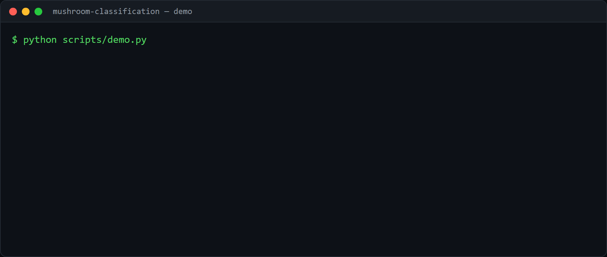

# mushroom-classification

[](https://github.com/SamirDiegoChavezCaceres/mushroom-classification/actions/workflows/ci.yml)  

Classify mushrooms as edible or poisonous from their traits - a clean,
categorical-heavy tabular ML pipeline.

Runs offline on a synthetic dataset; point it at the public **UCI Secondary
Mushroom Dataset** for real results (see [`data/`](data/)).

## Demo



Generate it with [VHS](https://github.com/charmbracelet/vhs): `vhs demo.tape`.

## What it shows

- **Dtype-driven preprocessing.** Numeric and categorical columns are detected
  automatically, so the same pipeline trains on the small synthetic frame and on
  the wider real dataset without hand-listing columns.
- **Encoding that survives unseen categories.** Categoricals are one-hot encoded
  with `handle_unknown="ignore"`, so a value never seen during training does not
  crash prediction at serve time.
- **The metric that fits the cost.** Accuracy plus F1 for the poisonous class;
  the expensive mistake is calling a poisonous mushroom edible.

## Run it

```bash
pip install -e .
python scripts/train.py                  # synthetic
python scripts/train.py secondary_data.csv   # real UCI data
```

## Results

On the synthetic data: **accuracy ~0.87** and F1 for the poisonous class ~0.86
(fixed seed); expect higher on the real UCI dataset. Reproduce:

```bash
python scripts/train.py
```

## Tests

```bash
pip install -e ".[dev]"
pytest
```

Covers column type detection and that the model learns the signal and only ever
predicts valid labels.

## Limitations and next steps

- The synthetic data understates real accuracy; run on the UCI set for a number
  that means something.
- No probability calibration or feature-importance report yet.
- Next: add SHAP feature importances and cross-validation.

## License

MIT.
